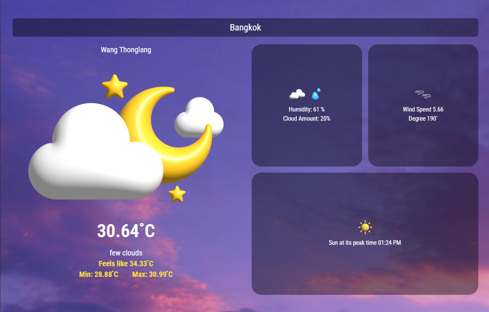

# Weather Report 🌤️
A simple and responsive weather app built with React.js that provides real-time weather updates using the OpenWeather API.

🚀 Features
✅ Search for any city and get weather details
✅ Displays temperature, humidity, wind speed, and more
✅ Uses Geolocation API to fetch weather for your current location
✅ Responsive design with background video and dynamic weather icons

🛠️ Technologies Used
React.js (useState, useEffect)
Tailwind CSS for styling
OpenWeather API for weather data
Vercel for deployment

### 📸 Screenshot  

🌍 Live Demo
https://weather-report-nine-pearl.vercel.app/
